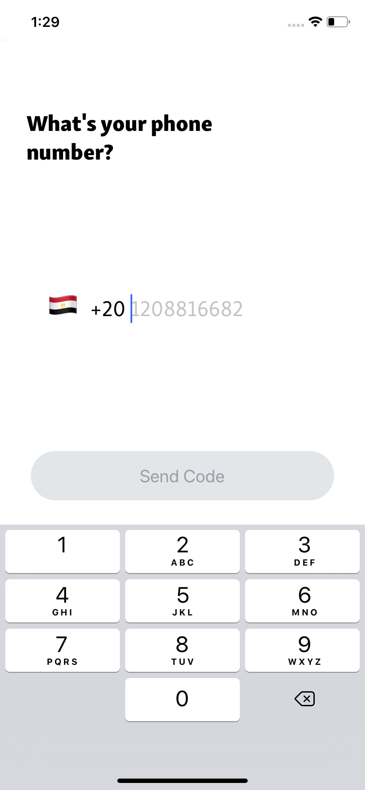
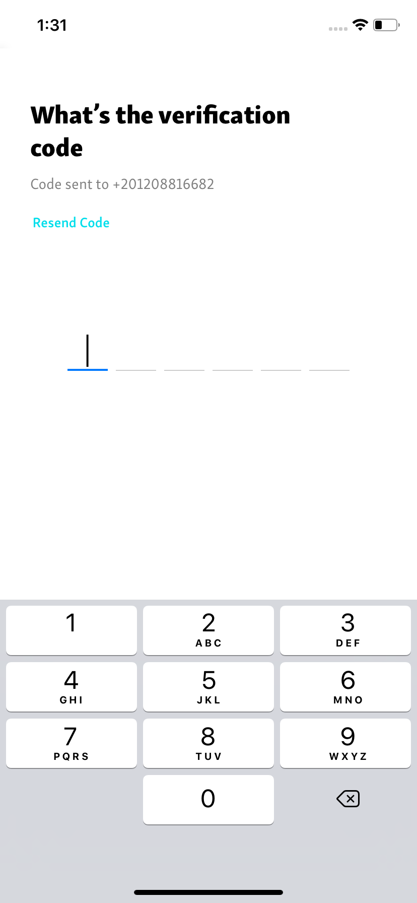

# Project : Harmonica App
## By  Fouad Asharf

## Table of contents
- [Description](#description)
- [Screenshots](#screenshots)
- [How to Run Project](#how-to-run-project)
- [Tested Platforms](#tested-platforms)
- [Attribution](#attribution)
- [Copyright and license](#copyright-and-license)

## Description
- A mobile application (Android or iOS) that allows users to register using their phone number then get a full profile(currently static). this project is a task for [Harmonica Company](https://www.hawaya.com/).

- Built using [React Native](https://reactnative.dev/), [Redux](https://redux.js.org/), [React Native Firebase](https://rnfirebase.io/), [React Native Elements](https://react-native-elements.github.io/react-native-elements/) and [React Navigation](https://reactnavigation.org/).

## Screenshots
Add Phone|Verify Code|Profile|
:---:|:---:|:---:
||


## How to Run Project
1. clone or download this repository.
      
2. run the app by using the following commands:
      1. Navigate to the project folder:
          ```
          cd harmonicaTask
          ```
      2. Install app dependancies:
          ```
          yarn install
          ```
          
      3. Start the app:
            -  Android
          ```
            yarn android
          ```
            -  IOS
          ```
            yarn ios
          ```
      4. Run unit tests:
          ```
          yarn test
          ```
           

## Tested Platforms
 - Android.
 - IOS.


## Attribution
* [React Native Firebase](https://rnfirebase.io/)
* [React Native Elements](https://react-native-elements.github.io/react-native-elements/)
* [React Navigation](https://reactnavigation.org/)
* [React-Native-INTL-Phone-Input](https://github.com/MuhammedAlmaz/React-Native-INTL-Phone-Input#readme)
* [react-native-confirmation-code-field](https://github.com/retyui/react-native-confirmation-code-field#readme)
* [React Native Testing Library](https://callstack.github.io/react-native-testing-library/)


## Copyright and License
- supplied without rights.

